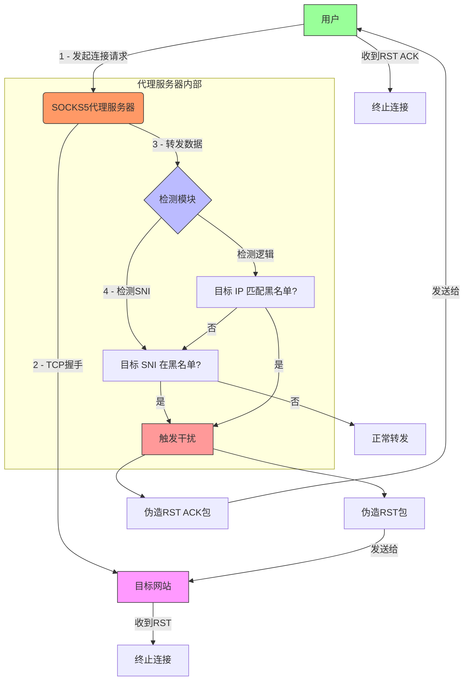
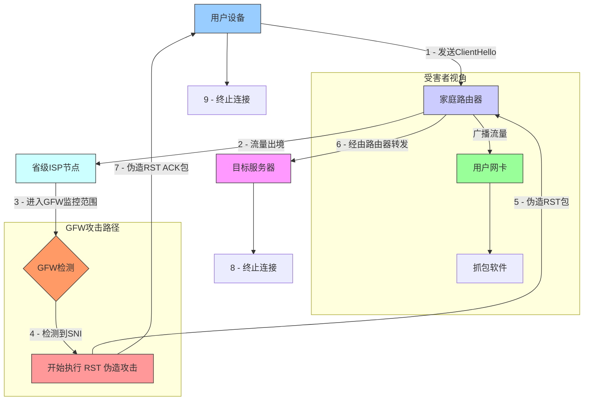
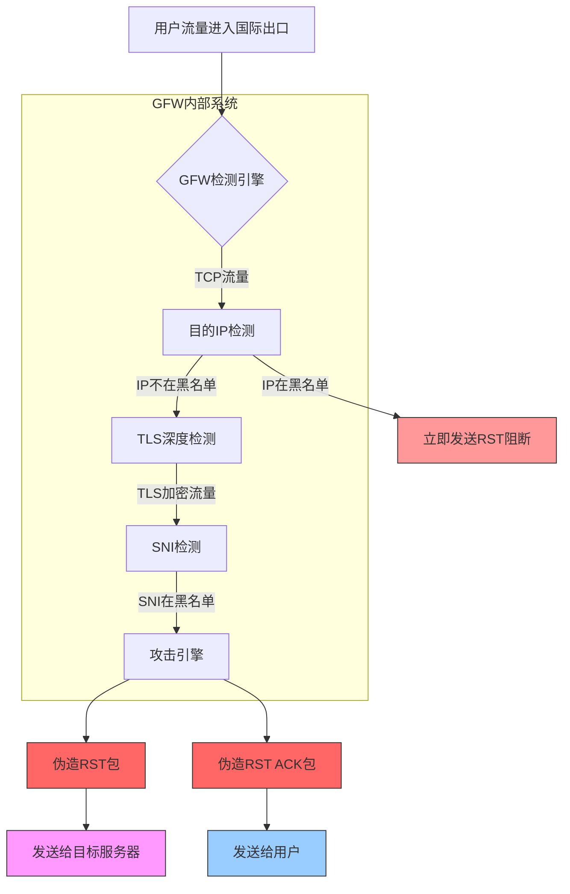


为了快速完成文章，部分程序代码拷贝自网络或 DeepSeek R1


8 月 20 日凌晨，鄙人发现自己的博客打不开了，故开始排查。我尝试访问 [kuohublog.netlify.app](https://kuohublog.netlify.app) 尝试绕过 Cloudflare 缓存，无果。

根据经验，我快速想到可能是由外部因素导致，迅速开始多次重复实验并收集抓包数据。


本文仅作理论分析，不讨论政治内容。

从网络包的会话时序图看，大概经历了这么几个步骤：
1. TCP 三次握手：SYN（发）
2. **异常的 RST ACK**（收）
3. SYN 重传（发）
4. TCP 三次握手：SYN ACK（收）
5. TCP 三次握手：ACK（发）
6. HTTPS 握手：Client Hello (SNI)（发）
7. **异常的 RST ACK**（收）
8. HTTPS 握手：ACK（收）
9. **异常的 RST**（发，疑似伪造）
10. HTTPS 握手：PSH ACK（发）
11. **异常的 RST**（发，疑似伪造）
12. **异常的 RST ACK**（收）

根据经验能够快速判断这是一个复杂的 RST 伪造攻击。有趣的是在直连状态下，几乎所有的境外网站全部都挂了，哪怕我自己阿里云香港的服务器也挂掉了。又根据经验，能够快速判断这也许是 GFW 导致的，此时网络上也流传出了来自多地相同情况的报告。那么至此，基本确定就是由 GFW 导致的一场大规模的网络故障。

多数报告指出，这次事故只影响到了境外 IP 的 443/tcp 端口，也庆幸如此，并且事故发生在半夜。

# 各个异常包的分析
下面，就开始逐一分析每个异常包，观察 GFW 到底是怎么进行拦截的。


快速解释一下 RST 是什么意思：TCP 的 RST（Reset）包，用于结束一个 TCP 连接，并返回一个错误信息给发送方。


## 序号 2：异常的 RST ACK（收） —— TCP 包检测
从第 2 个包开始看起，这是一个非常标准的 RST ACK 包，GFW 监听到了一个目标 IP 为境外 IP 的 TCP 包，快速响应了一个 RST ACK


## 序号 7：异常的 RST ACK（收） —— SNI 阻断
首先要了解 SNI 是什么：想象一下你去参加一个大型聚会，这个聚会有很多不同的房间，每个房间代表一个不同的网站。SNI 就相当于告诉接待人员你需要去哪个房间。SNI 的出现是为了解决一个服务器可能部署多个网站服务而诞生的，但他也留下了 Web 安全最后一道缝隙 —— SNI 通过明文传输。

GFW 就是通过这一漏洞，去阻止境外连接的：扫描每个 TCP 包，如果发现是 Client Hello 就再扫描 SNI 是否在黑名单内，是就发送 RST ACK


## 序号 9 & 11：异常的 RST（发，疑似伪造） —— RST 伪造
9 号包和 11 号包都是 RST 包，然而有趣的是，这两个包再抓包软件内都显示是由本地发出去的。显然这个包被篡改过，目的是为了迷惑网络维护人员，使其难以确定攻击方的身份。由于 GFW 篡改过的包很特殊，所以不论在连接发起方还是接收方都难以排查出真正的攻击方，使其没有强而有力的证据表明就是 GFW 干的，这不仅依赖 GFW 在整个互联网中地位，也依赖于 GFW 的工作性质。


这个部分就是本文分析的重点了，按理说这个 RST 包怎么也得是 GFW 给 PC 发，怎么就变成 PC 给目标服务发了呢？就是因为 RST 伪造。

想象每个 TCP 包都是一个快递，快递需要有快递单：

| 标题              | 值                 |
|-----------------|-------------------|
| 发件方姓名 (Src IP)  | 192.168.31.27     |
| 发件方地址 (Src MAC) | 86:52:93:F7:10:39 |
| 收件方姓名 (Dst IP)  | 172.67.186.188    |
| 下一站地址 (Dst MAC) | 5C:02:14:B2:28:C3 |
| 标识 (Flag)       | 你好 (SYN)          |


实际的网络连接中，不可能直接把包给到服务器，就像快递也需要中转站一样，但又不同于快递，快递单上不会存储中转站的地址，而网络包中写的则是下一个节点的地址，所以这里为了严谨，写的是 “下一站地址” 而不是 “收件人地址”


而 GFW 就像快递中转站的工作人员，每个工作人员应尽的义务就是修改快递单上的 “下一站地址”，然后继续接力把包裹传下去，直到到达目标地址。


在专业的网络术语中，这个节点通常是 ISP，每台设备都会维护一张叫 “路由表” 的大表，可以根据 IP 找到对应的下一个节点的地址


GFW 监控着大陆内全部的网络流量，自然可以借此之便，找出不希望发出去的数据包，然后错误地篡改数据包信息，比如还是上面那个数据包，我可以改成下面这样

| 标题              | 值（原始）                 | 值（篡改后）            |
|-----------------|-----------------------|-------------------|
| 发件方姓名 (Src IP)  | ~~192.168.31.27~~     | 172.67.186.188    |
| 发件方地址 (Src MAC) | ~~86:52:93:F7:10:39~~ | 5C:02:14:B2:28:C3 |
| 收件方姓名 (Dst IP)  | ~~172.67.186.188~~    | 92.168.31.27      |
| 下一站地址 (Dst MAC) | ~~5C:02:14:B2:28:C3~~ | 86:52:93:F7:10:39 |
| 标识 (Flag)       | ~~你好 (SYN)~~          | 去你的吧 (RST)        |

### 攻击模拟
为了方便，这里不演示完整攻击流程，仅模拟这一步中的 RST 伪造，以下是攻击思路：



测试攻击程序你可以在 [Github Gist](https://gist.github.com/daizihan233/e6172bfd1b8ff0359892412e88b0642c) 找到


你所需要关心的，就是这三个包。第一个包是 Client Hello，我这里使用我的个人博客作为测试，第三个包是 RST ACK，是攻击程序发给受害者的，我们先来看比较好解释的第三个包：

```golang
func (s *InterferenceStrategy) sendFakeRSTACK(conn *TCPConnection, fromServer bool) {
	var srcIP, dstIP net.IP
	var srcPort, dstPort uint16

	if fromServer {
		srcIP = conn.ServerIP  // 将源 IP 修改为目标服务器 IP
		srcPort = conn.ServerPort
		dstIP = conn.ClientIP  // 将目的 IP 改为受害者 IP
		dstPort = conn.ClientPort
	} else {
		// ...
	}

	fmt.Printf("[SIM] Sent RST ACK packet: %s:%d -> %s:%d\n", srcIP, srcPort, dstIP, dstPort)
}
```

它只是做了一个简单的修改，将源 IP 修改为目标服务器 IP，将目的 IP 修改为受害者 IP，然后发送一个 RST ACK 包给受害者，这样受害者就无法继续接收数据了。而且在受害者视角，这个包是由目标服务器主动发送的。

最后讲第二个包，它是 RST 包，但是是发给目标服务器的，先看看模拟攻击中是如何实现的：
```golang
func (s *InterferenceStrategy) sendFakeRST(conn *TCPConnection, fromClient bool) {
	var srcIP, dstIP net.IP
	var srcPort, dstPort uint16

	if fromClient {
		srcIP = conn.ClientIP  // 将源 IP 改为受害者 IP
		srcPort = conn.ClientPort
		dstIP = conn.ServerIP  // 将目的 IP 改为目标服务器 IP
		dstPort = conn.ServerPort
	} else {
		// ...
	}

	fmt.Printf("[SIM] Sent RST packet: %s:%d -> %s:%d\n", srcIP, srcPort, dstIP, dstPort)
}
```

这样在目标服务看来，发起方主动断开了连接，而不会发现异常。受害者也只能看着抓包软件中自己莫名其妙发了一个包而百思不得其解。

那或许你就要问了，这个包又不是受害者主动发起的，也不经过受害者的设备，为什么受害者能抓到这个包呢？

### 混杂模式
答案就是这一小节的标题：网卡的混杂模式。

来看看 GFW 视角下的攻击流程图：


是的，如图，伪造的 RST 包会再次经过家庭路由器，然后发送给目标服务器。当抓包软件启动时，抓包软件会开启混杂模式，也就是监听局域网内的所有流量，找到和自己有关的就记录下来。所以其实抓包软件也不知道这个包到底是不是你自己发的。GFW 把篡改的包重新送回路由器，路由器按照规定广播这个包到局域网内，然后被你开着混杂模式的设备监听到了，抓包软件一看嗯和自己有关，便就记录下来了。

## 序号 12：异常的 RST ACK（收）
由 9 & 11 号包的猜测，没啥好说的，最后的补刀而已，彻底断开客户端与服务端的连接。因为 9 & 11 伪造的 RST 包不是由发送者生成的，会导致 TCP 连接一直开着然后一直在重传，浪费不必要的网络资源，所以这里 GFW 会再发一个 RST ACK 包给客户端，结束这个 TCP 连接。


## 完整攻击链

至此我们可以画出 GFW 视角下的完整攻击链

