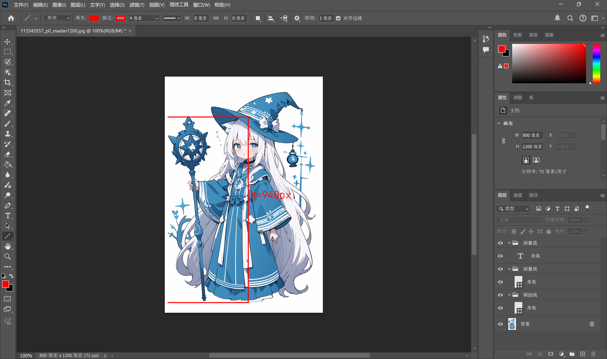
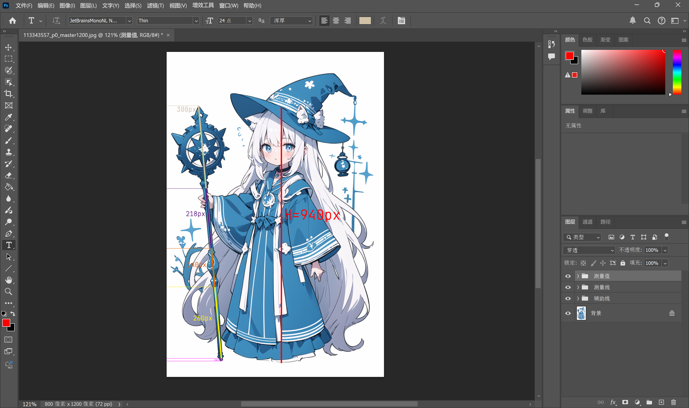
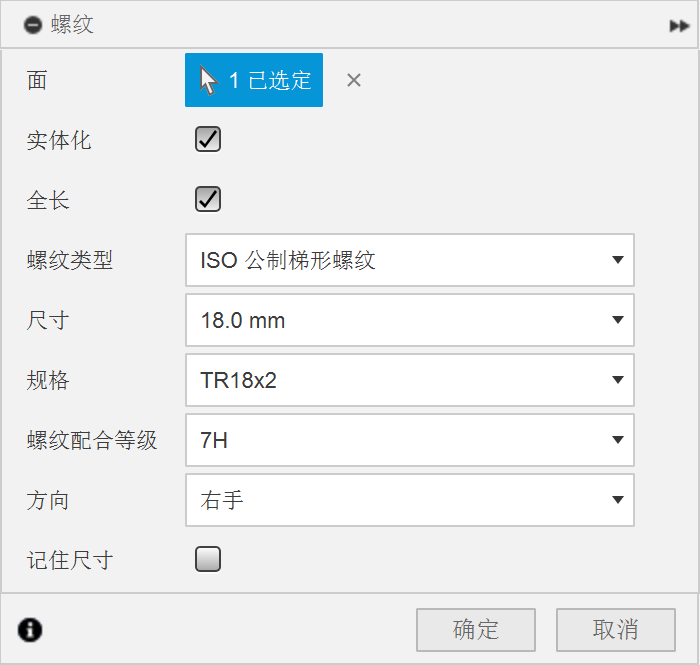
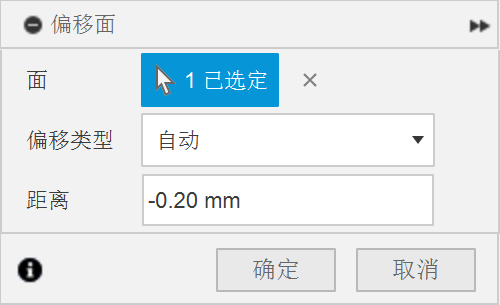
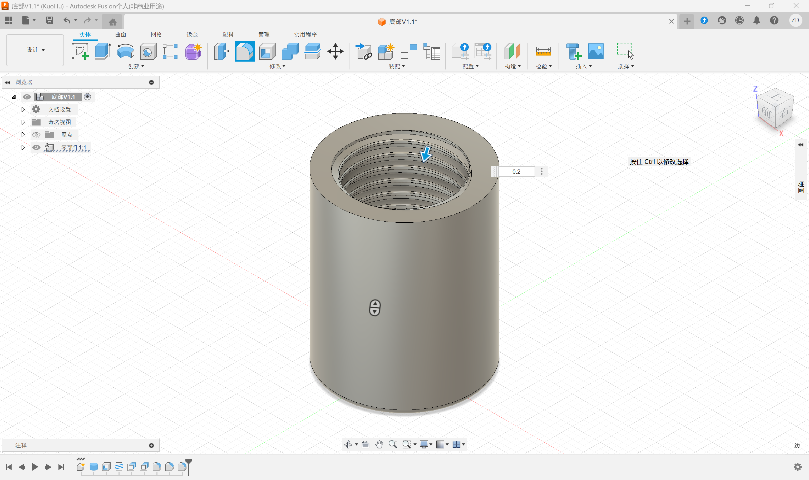
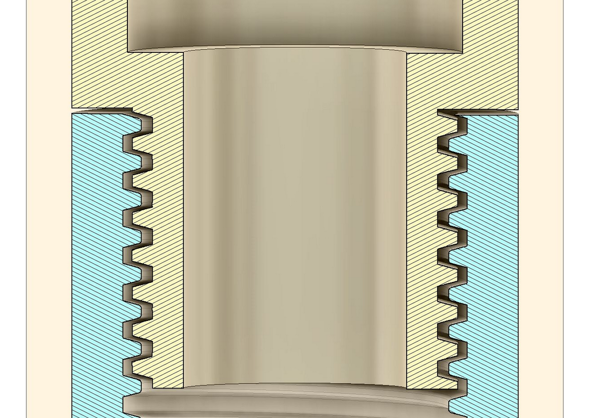

快开学了，不想写作业，于是打算整点烂活（？

这篇文章应该会时不时更新，做到哪写到哪

# 起因
去年（2024）冬天，一个夜晚，上床之后先在被窝躺了一会儿，困了打算关灯，但是灯离床很远，故下床关灯，很冷，关完之后一片漆黑，看不清任何东西，被床底板绊倒了，人倒是没啥事儿，但决定解决一下这个问题。

想了很多种解决方案，基本都因为种种原因否了，最终决定换一个米家的智能灯泡，加一个米家的蓝牙开关代替物理开关。那么说完务实的就该说点不务实的了：日常逛 GitHub 的时候看见[自己的 GitHub 头像](https://www.pixiv.net/artworks/113343557)，寻思说诶↑🤓，做个魔杖罢（？）还是支持 IoT 的，多么现代化呐👍👍👍

对大概就是这样，所以就有了这篇文章。那你也许就要问了，Fusion 也不能做 IoT 啊，为啥这文章叫 Fusion 初尝试呢


其实也不是不能，Fusion 好像也能做 PCB， ~~但是我不会！（？~~


啊，问得好，因为我目前只打算做个外壳验证，还不打算做 IoT 的部分， ~~主要因为确实没那个技术~~，但做事情总得一步步来，是吧。3D 打印其实我也是头回接触，所以在这我打算写一篇 Blog 记录我制作的过程，此前主要都是在研究桌面端和后端的开发，一个屏幕还能被开发出多少作用呢？那物理世界呢？所以从那个冬天开始我就一直想做一个这个东西。但因为实在没什么知识储备，我一直没有信心开始，但最近我想，不妨先开始罢，遇到困难再去解决。为了防止自己又半途而废，所以打算每有一些进展就同步到 Blog 上。至于 IoT 的部分，大概是需要另起一篇文章了，很大可能要等我中考结束之后再说了。

其实在迁移 Blog 之前有一篇还没发的文章是有关做这个的，但是那篇文章很不幸在迁移的时候丢了，我还没发现。那篇文章里用的是 AutoCAD，但是处理复杂曲面时真的太难用了，查阅资料发现更好用的 Fusion，所以换成了这个软件，本文使用的 Fusion 是个人免费版本。

# 取数据
正如上文所说，原 Blog 有一篇未发文章，虽然那篇文章很乱，但是有很多已经测算好可以直接用的数据。事已至此，那重写一次罢。由于[原图本身](https://www.pixiv.net/artworks/113343557)是 AIGC 的，没有可供参考的设定数据，所以这里先指定一下：以人物身高为参考单位，人物身高取 153cm。


在原 Blog 未发文章中，身高取值是本文作者身高 170cm，但是这里考虑到仅作外壳验证，为了省材料，这里取值缩小 10%（即原先的 90%）


咋取呢，思路也简单：画一条代表人物身高的直线，取这条直线的长度 $H$，再绘制出代表每个部分的直线，取长度 $L$， 分别代入计算：
$$
\frac{L}{H}\times  153cm
$$
就能取到每个部分在物理世界中的对应长度了

## 身高
这里用 Photoshop 来绘制直线：

取到 $H = 940px$

## 物体
用同样的办法测量并求值：

带入上文的式子进行分别计算：

| 部分 | px  | cm  | mm   |
|----|-----|-----|------|
| 顶部 | 300 | 50  | 500  |
| 上  | 218 | 35  | 350  |
| 中  | 140 | 25  | 250  |
| 下  | 260 | 40  | 400  |
| 底部 | 6   | 3   | 30   |
| 全长 | 924 | 153 | 1530 |


如果你口算能力比较强，会发现实际上上面的数据是错误的，因为线条有粗细，而且为了计算方便，部分数值进行了四舍五入操作，导致在测量时存在误差，全长的实际测量值是 924px，而预期的测量值是 940px，也就是有 22.5mm 的误差：
$$
\frac{L}{H}\times  153cm = \frac{16px}{960px}\times 153px = 2.55cm = 25.5mm
$$
在 px 转换到 cm 的过程中，为了方便后续计算与制作，也采取了四舍五入的办法，底部在原图中的长度应为 1cm 左右，但是这样实在太短了，制作与拼装并不方便，所以这里指定其长度为 3cm
$$
\frac{L}{H}\times  153cm = \frac{6px}{960px}\times 153px \approx 0.976595cm \approx 1cm
$$


# 制作
## 底部
在 Fusion 中创建一个圆柱体，直径 24mm，高 30mm；然后对其上表面进行抽壳，内壁厚度为 3mm；之后在其内表面创建一个这样的螺纹：


为了能够 3D 打印，是需要勾选 `实体化` 的。这个结论是作者自己摸索出来的，作者没系统学过这些，这个软件也是刚开始边学边做，有些地方是询问的 DeepSeek，比如这里 DeepSeek 说不能勾选 `实体化`，会导致各种各样的问题，我也不知道为什么这么说，但事实就是你如果不勾选 `实体化` 那么这个螺纹在文件中只是个标记，并不能实际地被打印出来


按 Q 键对螺纹的上表面与中间部分分别偏移面 -0.2mm


在处理中间部分时，由于破坏了原先的结构，所以偏移类型要从 `自动` 改为 `新建偏移`
做这个部分时参考的视频：[https://www.bilibili.com/video/BV1xJBRYAEe8/](https://www.bilibili.com/video/BV1xJBRYAEe8/)
间隙取 0.2mm 是参考了 [嘉立创 3D 模型设计规范](https://www.jlc-3dp.cn/technicalColumnsDetails/27832.html)


最后再用 F 键对螺纹的直角部分做圆角处理：


圆角半径 0.2mm 只是因为 “俺寻思”，我也不知道有没有更好的取值


另外为了好看可以把底部也做一下圆角处理，半径 1mm。

最后就是以同样的方式制作测试件， ~~测试件就临时一用所以具体步骤就不写了~~

所以最终的截面应该长成这样：


我在两个组装件的接触面留了 0.3mm 的间隙，其实最开始是一个 Bug，我不知道为什么这俩螺纹拼接不上，有重合的部分，然后我把测试件向上平移了 0.3mm 后截面就正常了，不过好像这里本来就应该留一个间隙？



去打印了，之后等打印完到货再说
